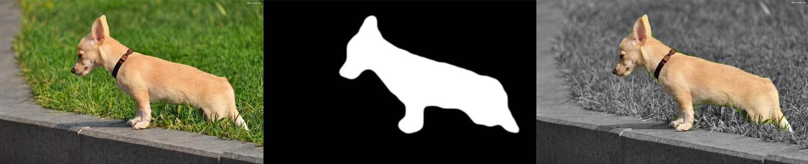

# Image Segmenter ios
Core ML Image Segmentation on ios
 

## Examples

##mlmodel
Core ML model file are converted from <a href="https://github.com/tensorflow/models/tree/master/research/deeplab">deeplab MobileNetv2</a>
## Usage
 

```swift
 let sourceImg = UIImage.init(named: "test.jpg")!
 let segmentImg = sourceImg.segmentation()
```